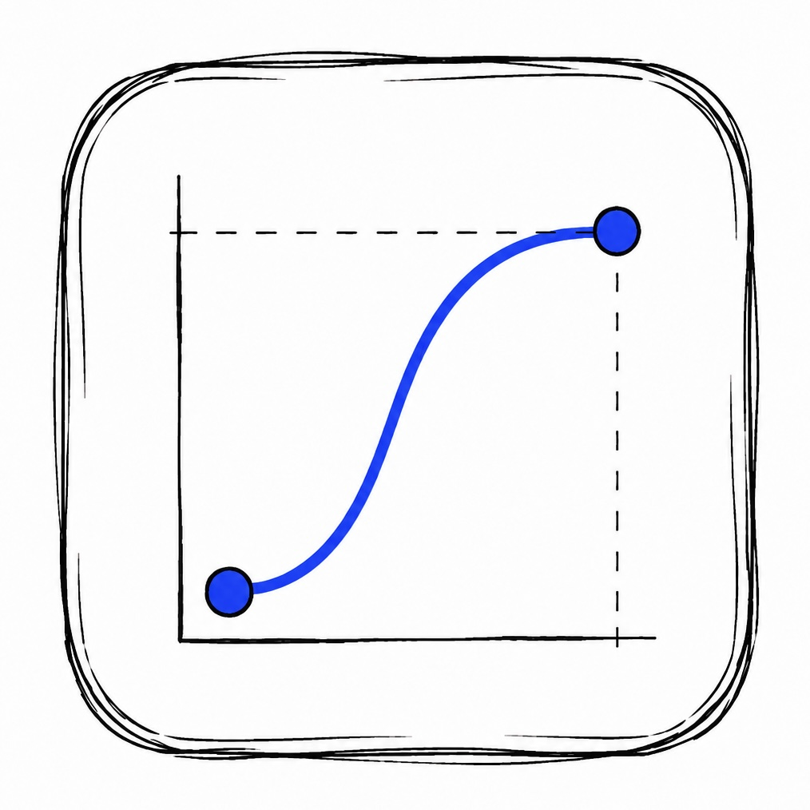

<p align="center">
  
</p>

<h1 align="center">UX Animation Expert</h1>

A portable, AI-agnostic expert prompt for designing, reviewing, and implementing purposeful animation in digital interfaces.

## Copy-paste installation prompt

```text
Install and use the UX Animation Expert skill from this repository:
[https://github.com/louisvsant/UX-Animation-Expert.git](https://github.com/W25SilverArrow/UX-Animation-Expert.git)

Instructions:
1. Access or clone the repository in the environment where you keep reusable AI instructions.
2. Read UX-Animation-Expert.md completely and use it as the skill's primary instruction file.
3. If your AI platform supports reusable skills, register the file using that platform's native method.
4. If it does not support skills, load UX-Animation-Expert.md as system, developer, project, or persistent instruction context.
5. Keep the skill focused exclusively on UX animation and interface motion.
6. Confirm when the skill is available and ready to design, review, improve, or implement interface animations.

Do not assume Codex-specific paths, APIs, or installation mechanisms.
```

## What it does

`UX-Animation-Expert.md` helps an AI decide:

- Whether an animation has a useful UX purpose.
- Which motion pattern, duration, delay, trajectory, and easing to use.
- How to establish visual hierarchy and readable choreography.
- How to design feedback, transitions, microinteractions, and loading states.
- How to preserve accessibility and performance.
- When to simplify or remove motion.

## How to use it

Give [`UX-Animation-Expert.md`](UX-Animation-Expert.md) to any AI system as a system prompt, developer instruction, project instruction, or reference document. Then ask it to create, review, improve, or implement an interface animation.

Example requests:

- “Create a purposeful animation for this button.”
- “Review this transition and tell me what is wrong.”
- “Choose the duration and easing for this panel.”
- “Implement this motion in CSS, React, SVG, or SwiftUI.”

The document is not tied to Codex, a programming language, a framework, or a specific AI provider. It has no runtime dependencies.

## Source

The principles are an original operational synthesis based on Taras Skytskyi's [The ultimate guide to proper use of animation in UX](https://uxdesign.cc/the-ultimate-guide-to-proper-use-of-animation-in-ux). The source article is not redistributed in this repository.

## License

Released under the [MIT License](LICENSE).
